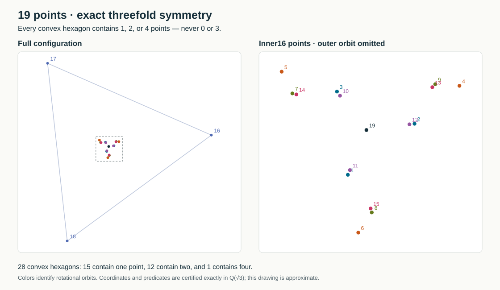

# A 19-point solution with exact threefold symmetry

The set is in general position. Every convex hexagon contains **1, 2, or 4**
other points—never 0 or 3. It has exact Euclidean 120-degree rotational symmetry.



Take the origin and the 120°/240° rotations of these six representatives:

| x | y |
| ---: | ---: |
| -667 | -1605 |
| 3333 | 1586 |
| -2656 | 1313 |
| -948 | 1232 |
| 2362 | 1537 |
| 33666 | 3722 |

For a representative(a,b), the two rotations are

`((-a-b√3)/2, (a√3-b)/2)` and `((-a+b√3)/2, (-a√3-b)/2)`.

This specifies all 19 coordinates exactly; no floating-point tolerance is used.
The machine-readable [witness.qsqrt3](witness.qsqrt3) stores the same set
uniformly enlarged by2, so all coefficients are integers. Its rows are
`x_a x_b y_a y_b`, meaning `(x_a+x_b√3, y_a+y_b√3)`.

## Exhaustive certificates

- All 969 triples have nonzero determinant.
- All 27,132 six-point subsets were tested for convexity and their exact
  number of interior points.
- There are 28 convex hexagons: 15 contain one point, 12 contain two points,
  and 1 contains four points. None contain 0 or 3.
- The exact group action is checked algebraically on every orbit.
- Compaction preserves all 969 orientation signs of the discovered witness.
- The compact signs are checked against the original 2,311,196-clause CNF,
  including its 327-variable compressed orientation mapping.

[Pure-Python exact certificate](independent_python.json) lists every convex
hexagon and its interior labels. This checker imports no previous geometry
verifier or search code. [Independent C++ algebraic check](independent_cpp.json)
agrees. [CNF recheck](original_cnf_check.json) records a fresh complete SAT
extension and explicit scan of every original clause.

`representative_input.pts` is only a reconstruction input for the C++ checker:
its nonleader rows are placeholders, **not** a geometric witness. Consequently
the C++ report's input-sign-change count refers to those placeholders. The
actual witness is `witness.qsqrt3`; all of its signs agree with the discovered
exact witness, as the [main certificate](certificate.json) records.

## Provenance and reproduction

Discovered in the unattended SAT/Localizer target-margin feedback portfolio,
`job013-symmetry19-target_margin`, sample4/job14. Original saved artifacts and
its earlier exact certificate are preserved in [original/](original/).
The successful warm realization took11.000s after a30s initial attempt with
nine target errors and a feedback repair changing three primary orientations.
The complete multi-sample job ran552.032s, from06:49:26 to06:58:38UTC.
The bounded compaction changes only the six orbit representatives and retains
the complete orientation type; it is not claimed coordinate-optimal.

```sh
python3 improvements/success19/certify.py --source \
  improvements/pipeline/unattended_20260905/runs/job013-symmetry19-target_margin/audit/sample4-job14
direct/vendor/venv/bin/python improvements/success19/check_original_cnf.py
```

The earlier nonrealizability certificates apply to different abstract
orientation assignments, not to this geometric problem or this solution.
