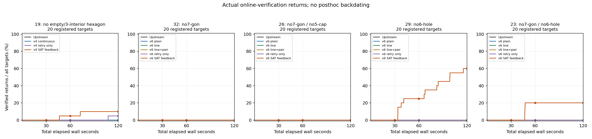

# Equal-total-time PointSAT study

Primary endpoint: first accepted solution returned by completed online verification within the total wall-time limit. The clock includes runtime preparation/import, native search, feedback, and online verification. SAT target sampling is outside it. Posthoc audits do not create or backdate primary success events.

Every registered target remains in each empirical success-curve denominator. Failures have no success event and retain censoring times. These are deliberately diverse, non-IID SAT targets with one seed each; no population success rate or universal speed multiplier is claimed. Retry-only arms help distinguish repeated geometric attempts from the additional SAT-feedback step. Exact settings remain in the registration.

This is a **cold realization-workflow comparison**, not the literal untouched PointSAT driver or steady-state batch throughput. The original arm combines the frozen original flippability implementation with the untouched native solver. Updated arms use the revised checker, persistent only within that trajectory. Conversion, required mapping, storage and geometry acceptance are common; no solver/cache is shared across targets or arms. Original → updated continuous includes both preparation and native-package changes. Updated plain/line/pair comparisons isolate those optional native flags; retry-only → feedback adds retargeting and its SAT overhead under the same segmented check schedule. Cold preparation can dominate short runs, especially for19 points.

Earlier native-budget runs are a distinct, partially completed diagnostic study—not equal-total-time controls and not pooled here.

The same fixed targets are reused after that diagnostic study; this is not an unseen holdout evaluation. Target-selection provenance is preserved below.

[Self-contained PDF](anytime-report.pdf)

[Vector figure](verified-returns.pdf)

## 19: no empty/3-interior hexagon

Registered targets: 20 per arm; total-time horizon: 120 s.

|Arm|Elapsed wall s|Verified returns / all targets|Observed through milestone or solved|Unobserved/early censored|
|---|---:|---:|---:|---:|
|Upstream|30|0 / 20|20|0|
|Upstream|60|0 / 20|20|0|
|Upstream|120|0 / 20|20|0|
|v4 continuous|30|0 / 20|20|0|
|v4 continuous|60|0 / 20|20|0|
|v4 continuous|120|0 / 20|20|0|
|v4 retry only|30|0 / 20|20|0|
|v4 retry only|60|0 / 20|20|0|
|v4 retry only|120|1 / 20|20|0|
|v4 SAT feedback|30|0 / 20|20|0|
|v4 SAT feedback|60|1 / 20|20|0|
|v4 SAT feedback|120|2 / 20|20|0|

Matched outcomes on the same registered targets (all arm pairs are retained in JSON):

|First → second|Wall s|First only|Second only|Both|Neither|Provisional pairs|
|---|---:|---:|---:|---:|---:|---:|
|Upstream → v4 continuous|30|0|0|0|20|0|
|Upstream → v4 continuous|60|0|0|0|20|0|
|Upstream → v4 continuous|120|0|0|0|20|0|
|Upstream → v4 retry only|30|0|0|0|20|0|
|Upstream → v4 retry only|60|0|0|0|20|0|
|Upstream → v4 retry only|120|0|1|0|19|0|
|Upstream → v4 SAT feedback|30|0|0|0|20|0|
|Upstream → v4 SAT feedback|60|0|1|0|19|0|
|Upstream → v4 SAT feedback|120|0|2|0|18|0|
|v4 retry only → v4 SAT feedback|30|0|0|0|20|0|
|v4 retry only → v4 SAT feedback|60|0|1|0|19|0|
|v4 retry only → v4 SAT feedback|120|0|1|1|18|0|

## 32: no7-gon

Registered targets: 20 per arm; total-time horizon: 120 s.

|Arm|Elapsed wall s|Verified returns / all targets|Observed through milestone or solved|Unobserved/early censored|
|---|---:|---:|---:|---:|
|Upstream|30|0 / 20|20|0|
|Upstream|60|0 / 20|20|0|
|Upstream|120|0 / 20|20|0|
|v6 plain|30|0 / 20|20|0|
|v6 plain|60|0 / 20|20|0|
|v6 plain|120|0 / 20|20|0|
|v6 line|30|0 / 20|20|0|
|v6 line|60|0 / 20|20|0|
|v6 line|120|0 / 20|20|0|
|v6 line+pair|30|0 / 20|20|0|
|v6 line+pair|60|0 / 20|20|0|
|v6 line+pair|120|0 / 20|20|0|
|v6 retry only|30|0 / 20|20|0|
|v6 retry only|60|0 / 20|20|0|
|v6 retry only|120|0 / 20|20|0|
|v6 SAT feedback|30|0 / 20|20|0|
|v6 SAT feedback|60|0 / 20|20|0|
|v6 SAT feedback|120|0 / 20|20|0|

Matched outcomes on the same registered targets (all arm pairs are retained in JSON):

|First → second|Wall s|First only|Second only|Both|Neither|Provisional pairs|
|---|---:|---:|---:|---:|---:|---:|
|Upstream → v6 plain|30|0|0|0|20|0|
|Upstream → v6 plain|60|0|0|0|20|0|
|Upstream → v6 plain|120|0|0|0|20|0|
|Upstream → v6 line|30|0|0|0|20|0|
|Upstream → v6 line|60|0|0|0|20|0|
|Upstream → v6 line|120|0|0|0|20|0|
|Upstream → v6 line+pair|30|0|0|0|20|0|
|Upstream → v6 line+pair|60|0|0|0|20|0|
|Upstream → v6 line+pair|120|0|0|0|20|0|
|Upstream → v6 retry only|30|0|0|0|20|0|
|Upstream → v6 retry only|60|0|0|0|20|0|
|Upstream → v6 retry only|120|0|0|0|20|0|
|Upstream → v6 SAT feedback|30|0|0|0|20|0|
|Upstream → v6 SAT feedback|60|0|0|0|20|0|
|Upstream → v6 SAT feedback|120|0|0|0|20|0|
|v6 retry only → v6 SAT feedback|30|0|0|0|20|0|
|v6 retry only → v6 SAT feedback|60|0|0|0|20|0|
|v6 retry only → v6 SAT feedback|120|0|0|0|20|0|

## 26: no7-gon / no5-cap

Registered targets: 20 per arm; total-time horizon: 120 s.

|Arm|Elapsed wall s|Verified returns / all targets|Observed through milestone or solved|Unobserved/early censored|
|---|---:|---:|---:|---:|
|Upstream|30|0 / 20|20|0|
|Upstream|60|0 / 20|20|0|
|Upstream|120|0 / 20|20|0|
|v6 plain|30|0 / 20|20|0|
|v6 plain|60|0 / 20|20|0|
|v6 plain|120|0 / 20|20|0|
|v6 line|30|0 / 20|20|0|
|v6 line|60|0 / 20|20|0|
|v6 line|120|0 / 20|20|0|
|v6 line+pair|30|0 / 20|20|0|
|v6 line+pair|60|0 / 20|20|0|
|v6 line+pair|120|0 / 20|20|0|
|v6 retry only|30|0 / 20|20|0|
|v6 retry only|60|0 / 20|20|0|
|v6 retry only|120|0 / 20|20|0|
|v6 SAT feedback|30|0 / 20|20|0|
|v6 SAT feedback|60|0 / 20|20|0|
|v6 SAT feedback|120|0 / 20|20|0|

Matched outcomes on the same registered targets (all arm pairs are retained in JSON):

|First → second|Wall s|First only|Second only|Both|Neither|Provisional pairs|
|---|---:|---:|---:|---:|---:|---:|
|Upstream → v6 plain|30|0|0|0|20|0|
|Upstream → v6 plain|60|0|0|0|20|0|
|Upstream → v6 plain|120|0|0|0|20|0|
|Upstream → v6 line|30|0|0|0|20|0|
|Upstream → v6 line|60|0|0|0|20|0|
|Upstream → v6 line|120|0|0|0|20|0|
|Upstream → v6 line+pair|30|0|0|0|20|0|
|Upstream → v6 line+pair|60|0|0|0|20|0|
|Upstream → v6 line+pair|120|0|0|0|20|0|
|Upstream → v6 retry only|30|0|0|0|20|0|
|Upstream → v6 retry only|60|0|0|0|20|0|
|Upstream → v6 retry only|120|0|0|0|20|0|
|Upstream → v6 SAT feedback|30|0|0|0|20|0|
|Upstream → v6 SAT feedback|60|0|0|0|20|0|
|Upstream → v6 SAT feedback|120|0|0|0|20|0|
|v6 retry only → v6 SAT feedback|30|0|0|0|20|0|
|v6 retry only → v6 SAT feedback|60|0|0|0|20|0|
|v6 retry only → v6 SAT feedback|120|0|0|0|20|0|

## 29: no6-hole

Registered targets: 20 per arm; total-time horizon: 120 s.

|Arm|Elapsed wall s|Verified returns / all targets|Observed through milestone or solved|Unobserved/early censored|
|---|---:|---:|---:|---:|
|Upstream|30|0 / 20|20|0|
|Upstream|60|0 / 20|20|0|
|Upstream|120|0 / 20|20|0|
|v6 plain|30|0 / 20|20|0|
|v6 plain|60|0 / 20|20|0|
|v6 plain|120|0 / 20|20|0|
|v6 line|30|0 / 20|20|0|
|v6 line|60|0 / 20|20|0|
|v6 line|120|0 / 20|20|0|
|v6 line+pair|30|0 / 20|20|0|
|v6 line+pair|60|0 / 20|20|0|
|v6 line+pair|120|0 / 20|20|0|
|v6 retry only|30|0 / 20|20|0|
|v6 retry only|60|0 / 20|20|0|
|v6 retry only|120|0 / 20|20|0|
|v6 SAT feedback|30|0 / 20|20|0|
|v6 SAT feedback|60|5 / 20|20|0|
|v6 SAT feedback|120|12 / 20|20|0|

Matched outcomes on the same registered targets (all arm pairs are retained in JSON):

|First → second|Wall s|First only|Second only|Both|Neither|Provisional pairs|
|---|---:|---:|---:|---:|---:|---:|
|Upstream → v6 plain|30|0|0|0|20|0|
|Upstream → v6 plain|60|0|0|0|20|0|
|Upstream → v6 plain|120|0|0|0|20|0|
|Upstream → v6 line|30|0|0|0|20|0|
|Upstream → v6 line|60|0|0|0|20|0|
|Upstream → v6 line|120|0|0|0|20|0|
|Upstream → v6 line+pair|30|0|0|0|20|0|
|Upstream → v6 line+pair|60|0|0|0|20|0|
|Upstream → v6 line+pair|120|0|0|0|20|0|
|Upstream → v6 retry only|30|0|0|0|20|0|
|Upstream → v6 retry only|60|0|0|0|20|0|
|Upstream → v6 retry only|120|0|0|0|20|0|
|Upstream → v6 SAT feedback|30|0|0|0|20|0|
|Upstream → v6 SAT feedback|60|0|5|0|15|0|
|Upstream → v6 SAT feedback|120|0|12|0|8|0|
|v6 retry only → v6 SAT feedback|30|0|0|0|20|0|
|v6 retry only → v6 SAT feedback|60|0|5|0|15|0|
|v6 retry only → v6 SAT feedback|120|0|12|0|8|0|

## 23: no7-gon / no6-hole

Registered targets: 20 per arm; total-time horizon: 120 s.

|Arm|Elapsed wall s|Verified returns / all targets|Observed through milestone or solved|Unobserved/early censored|
|---|---:|---:|---:|---:|
|Upstream|30|0 / 20|20|0|
|Upstream|60|0 / 20|20|0|
|Upstream|120|0 / 20|20|0|
|v6 plain|30|0 / 20|20|0|
|v6 plain|60|0 / 20|20|0|
|v6 plain|120|0 / 20|20|0|
|v6 line|30|0 / 20|20|0|
|v6 line|60|0 / 20|20|0|
|v6 line|120|0 / 20|20|0|
|v6 line+pair|30|0 / 20|20|0|
|v6 line+pair|60|0 / 20|20|0|
|v6 line+pair|120|0 / 20|20|0|
|v6 retry only|30|0 / 20|20|0|
|v6 retry only|60|0 / 20|20|0|
|v6 retry only|120|0 / 20|20|0|
|v6 SAT feedback|30|0 / 20|20|0|
|v6 SAT feedback|60|4 / 20|20|0|
|v6 SAT feedback|120|4 / 20|20|0|

Matched outcomes on the same registered targets (all arm pairs are retained in JSON):

|First → second|Wall s|First only|Second only|Both|Neither|Provisional pairs|
|---|---:|---:|---:|---:|---:|---:|
|Upstream → v6 plain|30|0|0|0|20|0|
|Upstream → v6 plain|60|0|0|0|20|0|
|Upstream → v6 plain|120|0|0|0|20|0|
|Upstream → v6 line|30|0|0|0|20|0|
|Upstream → v6 line|60|0|0|0|20|0|
|Upstream → v6 line|120|0|0|0|20|0|
|Upstream → v6 line+pair|30|0|0|0|20|0|
|Upstream → v6 line+pair|60|0|0|0|20|0|
|Upstream → v6 line+pair|120|0|0|0|20|0|
|Upstream → v6 retry only|30|0|0|0|20|0|
|Upstream → v6 retry only|60|0|0|0|20|0|
|Upstream → v6 retry only|120|0|0|0|20|0|
|Upstream → v6 SAT feedback|30|0|0|0|20|0|
|Upstream → v6 SAT feedback|60|0|4|0|16|0|
|Upstream → v6 SAT feedback|120|0|4|0|16|0|
|v6 retry only → v6 SAT feedback|30|0|0|0|20|0|
|v6 retry only → v6 SAT feedback|60|0|4|0|16|0|
|v6 retry only → v6 SAT feedback|120|0|4|0|16|0|

## Compute and interruptions

All recorded attempts are counted below, including failed and interrupted attempts—not only successes. Component CPU is measured processor consumption; wall is not a CPU substitute. Summed worker wall is not calendar duration. Parent totals and component totals overlap and must not be added. Posthoc audit costs are outside the primary clock and separate.

|Family|Arm|Attempts|Preparation CPU s|Native CPU s|Feedback CPU s|Online verification CPU s|Parent CPU s|Posthoc CPU s|Parent wall s|
|---|---|---:|---:|---:|---:|---:|---:|---:|---:|
|symmetry19|Upstream|20|325.64|2003.36|not recorded|0.43|2330.77|4.89|2400.63|
|symmetry19|v4 continuous|20|364.14|1966.37|not recorded|0.48|2342.73|5.21|2410.98|
|symmetry19|v4 retry only|20|363.56|1949.89|not recorded|3.37|2328.89|9.13|2398.23|
|symmetry19|v4 SAT feedback|20|364.26|1118.61|757.43|1.89|2256.27|12.91|2289.36|
|gons32|Upstream|20|111.55|2219.61|not recorded|29.43|2361.85|30.65|2400.52|
|gons32|v6 plain|20|16.36|2315.49|not recorded|43.38|2378.12|44.95|2409.76|
|gons32|v6 line|20|16.16|2313.68|not recorded|40.24|2372.97|42.21|2410.56|
|gons32|v6 line+pair|20|16.25|2317.13|not recorded|40.32|2376.61|42.46|2410.17|
|gons32|v6 retry only|20|16.31|2033.20|not recorded|322.41|2375.91|48.47|2409.39|
|gons32|v6 SAT feedback|20|16.29|1999.05|48.33|305.52|2376.40|48.60|2407.48|
|caps26|Upstream|20|28.36|2304.05|not recorded|0.05|2333.69|8.26|2400.46|
|caps26|v6 plain|20|7.66|2324.44|not recorded|0.05|2334.03|11.74|2406.21|
|caps26|v6 line|20|7.65|2322.41|not recorded|0.05|2332.04|11.79|2405.28|
|caps26|v6 line+pair|20|7.61|2324.90|not recorded|0.06|2334.50|10.94|2406.19|
|caps26|v6 retry only|20|7.71|2320.93|not recorded|0.41|2331.74|11.45|2406.21|
|caps26|v6 SAT feedback|20|7.62|2270.75|26.82|0.61|2333.10|11.95|2404.61|
|holes29|Upstream|20|102.18|2230.53|not recorded|3.57|2337.62|4.99|2400.52|
|holes29|v6 plain|20|39.79|2291.78|not recorded|6.18|2342.81|7.49|2410.59|
|holes29|v6 line|20|39.64|2292.75|not recorded|6.32|2343.72|7.68|2410.64|
|holes29|v6 line+pair|20|40.05|2290.00|not recorded|6.47|2341.58|7.82|2410.61|
|holes29|v6 retry only|20|40.06|2238.88|not recorded|55.08|2340.07|7.96|2410.28|
|holes29|v6 SAT feedback|20|39.58|1552.80|89.25|38.53|1726.96|16.73|1759.28|
|mixed23|Upstream|20|26.71|2306.48|not recorded|3.06|2337.44|4.30|2400.49|
|mixed23|v6 plain|20|19.03|2314.23|not recorded|5.01|2341.45|6.24|2410.11|
|mixed23|v6 line|20|19.07|2311.28|not recorded|5.34|2338.89|6.54|2410.12|
|mixed23|v6 line+pair|20|19.06|2312.75|not recorded|4.74|2339.74|5.94|2410.09|
|mixed23|v6 retry only|20|19.07|2273.43|not recorded|39.94|2336.37|6.04|2410.13|
|mixed23|v6 SAT feedback|20|19.12|1977.05|21.00|36.27|2058.57|8.11|2117.53|

Persisted attempts: 560; incomplete attempts: 0; repeated case/arm attempts: 0; verified events after the horizon (excluded): 0.

Statuses: `{"SOLVED": 19, "TIME_LIMIT": 541}`.

Online deadline-exceeded checks: 9; online checker errors: 0. Search CPU lower-bound attempts: 424; posthoc CPU lower-bound attempts: 0. Abruptly killed descendants can leave unrecorded CPU; these are explicitly lower bounds, not exact complete totals.

Source registration: [registration.json](<../../benchmarks/anytime_20260907/registration.json>), SHA256 `bc9b176c5c291e62660c29a78155b06943a0a5f9d92cd754158a429cc9812f58`.

Corpus provenance: `{"fresh": 9, "historical_initial_sat": 11}`. Fresh and reused/proof-filtered SAT target strata remain distinct. Historical selection did not inspect realization outcomes. The known positive-control type is excluded. The original benchmark CNF does not acquire generation-only cuts.

Outside-clock corpus construction: 1798.74 fresh-generation CPU s; 12.54 combined-corpus revalidation CPU s; 1.50 combine-controller CPU s. Fresh and combine timers are separate; historical generation sunk costs are not attributed to this batch.

## Separate earlier positive control

The known realizable control is excluded from the main target corpus. Its earlier native-budget diagnostic is not an equal-total-time trial; native timings are not interpreted as first verified-return times or pooled into these curves.

[Control provenance](<../../benchmarks/compare19_positive_control_20260907/result.json>), SHA256 `a3f57133eba3db0f7931ccdee4752ad52c460164fb86e3ac778683d7046b3b12`.

Machine snapshot: [reported hardware and environment](<../../benchmarks/scaling_machine_20260907.json>), SHA256 `0bd3a26900459081798e7de741a64ea7b80b292deea816ff2f7ee117ffe99099`. The recorded environment is virtualized; CPU topology is not evidence of dedicated physical cores. The benchmark has a two-worker limit.

The complete JSON retains event timestamps and certificate hashes, per-target censoring, all matched pairs, component timing coverage, and errors. No first-success time is inferred from a final coordinate file or posthoc audit. Operational failure is not an impossibility proof.

[Machine-readable report](report.json)
