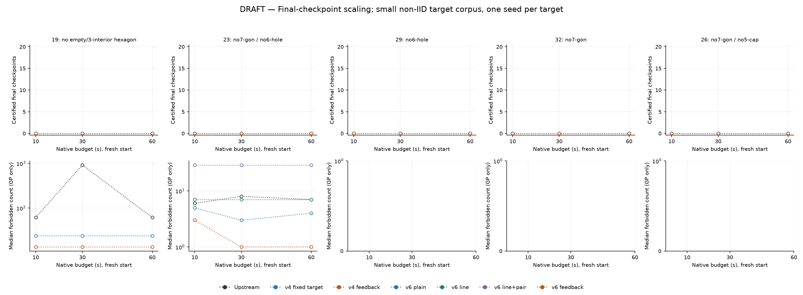
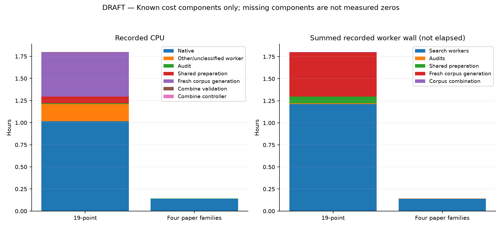

# PointSAT checkpoint scaling study — DRAFT

Five geometric problems, fixed SAT-only targets, and independent registered native budgets. This report reads existing results; it does not run search or alter earlier reports.

Primary endpoint: exact geometric validity of the final saved checkpoint. Any saved valid checkpoint is secondary. For19 points, numeric geometric validity is distinct from exact C3 reconstruction and from matching the original SAT target.

Each problem uses its registered target count and one native seed per target. Targets are deliberately diverse, not an IID population sample. Results can be seed-sensitive; neither a universal success rate nor a statistically established speed multiplier is claimed. Budgets restart from the same frozen input; curves are descriptive checkpoint comparisons, not survival curves. No actual first-success time is observed or interpolated.

**Incomplete snapshot:** pending targets are not failures. Plotted incomplete points are hollow; their certified counts are only current lower bounds. A missing metric is never replaced by zero.

The nineteen target corpus contains 9 fresh, 11 historical initial sat. Historical targets were selected in fixed source/line order from initial SAT assignments, not coordinate or feedback outcomes. Historical proof-filtered generation and fresh generation are distinct strata; the benchmark itself uses the original CNF without those additional cuts. The known positive-control canonical type was explicitly excluded. This is not an all-fresh or IID sample.



[Vector checkpoint figure](checkpoints.pdf)

Residual medians include only general-position final checkpoints; their denominators are shown below. Residuals count actual forbidden polygons/caps, not orientation-target errors, and are not comparable in scale between problems.

[Self-contained PDF report](scaling-report.pdf)

## 19: no empty/3-interior hexagon

Registered targets: 20 per arm/budget.

|Native budget s|Arm|Completed / registered|Valid final|Any saved valid|GP finals|Median forbidden in GP|Median target errors in GP|Errors|Overhead watchdogs|Audit errors|
|---:|---|---:|---:|---:|---:|---:|---:|---:|---:|---:|
|10|Upstream|12 / 20|0|0|12|61.50|30.00|0|0|0|
|10|v4 fixed target|12 / 20|0|0|12|24.00|31.50|0|0|0|
|10|v4 feedback|12 / 20|0|0|12|13.50|33.00|0|0|0|
|30|Upstream|14 / 20|0|0|14|919.50|172.50|0|0|0|
|30|v4 fixed target|12 / 20|0|0|12|24.00|30.00|0|0|0|
|30|v4 feedback|12 / 20|0|0|12|13.50|34.50|0|0|0|
|60|Upstream|12 / 20|0|0|12|61.50|28.50|0|0|0|
|60|v4 fixed target|12 / 20|0|0|12|24.00|30.00|0|0|0|
|60|v4 feedback|12 / 20|0|0|12|13.50|33.00|0|0|0|

Paired final-checkpoint outcomes on the same completed targets:

|Budget s|First → second|Complete pairs|First only|Second only|Both|Neither|
|---:|---|---:|---:|---:|---:|---:|
|10|Upstream → v4 fixed target|12|0|0|0|12|
|10|Upstream → v4 feedback|12|0|0|0|12|
|10|v4 fixed target → v4 feedback|12|0|0|0|12|
|30|Upstream → v4 fixed target|12|0|0|0|12|
|30|Upstream → v4 feedback|12|0|0|0|12|
|30|v4 fixed target → v4 feedback|12|0|0|0|12|
|60|Upstream → v4 fixed target|12|0|0|0|12|
|60|Upstream → v4 feedback|12|0|0|0|12|
|60|v4 fixed target → v4 feedback|12|0|0|0|12|

Within-target effect of increasing the budget (same registered seed and initial SAT target):

|Arm|Budget change s|Complete pairs|Validity gains|Validity losses|Paired GP|Fewer / same / more forbidden|Median forbidden change|
|---|---:|---:|---:|---:|---:|---|---:|
|Upstream|10 → 30|12|0|0|12|3 / 9 / 0|0.00|
|Upstream|10 → 60|12|0|0|12|3 / 9 / 0|0.00|
|Upstream|30 → 60|12|0|0|12|3 / 7 / 2|0.00|
|v4 fixed target|10 → 30|12|0|0|12|0 / 11 / 1|0.00|
|v4 fixed target|10 → 60|12|0|0|12|0 / 9 / 3|0.00|
|v4 fixed target|30 → 60|12|0|0|12|0 / 10 / 2|0.00|
|v4 feedback|10 → 30|12|0|0|12|1 / 7 / 4|0.00|
|v4 feedback|10 → 60|12|0|0|12|2 / 10 / 0|0.00|
|v4 feedback|30 → 60|12|0|0|12|4 / 7 / 1|0.00|

Change means higher-budget minus lower-budget residual, computed per paired target—not subtraction of group medians. Negative is better. Both final checkpoints need stored, hash/content-checked GP audit certificates for a residual pair. Missing pair sides, audit exclusions, orientation-error changes, and snapshot timestamps are retained in report.json. Longer runs can lose final-checkpoint validity; both gains and losses are shown.

## 23: no7-gon / no6-hole

Registered targets: 20 per arm/budget.

|Native budget s|Arm|Completed / registered|Valid final|Any saved valid|GP finals|Median forbidden in GP|Median target errors in GP|Errors|Overhead watchdogs|Audit errors|
|---:|---|---:|---:|---:|---:|---:|---:|---:|---:|---:|
|10|Upstream|1 / 20|0|0|1|6|34|0|0|0|
|10|v6 plain|1 / 20|0|0|1|5|38|0|0|0|
|10|v6 line|1 / 20|0|0|1|7|30|0|0|0|
|10|v6 line+pair|1 / 20|0|0|1|29|28|0|0|0|
|10|v6 feedback|1 / 20|0|0|1|3|43|0|0|0|
|30|Upstream|1 / 20|0|0|1|8|33|0|0|0|
|30|v6 plain|1 / 20|0|0|1|3|32|0|0|0|
|30|v6 line|1 / 20|0|0|1|7|29|0|0|0|
|30|v6 line+pair|1 / 20|0|0|1|29|28|0|0|0|
|30|v6 feedback|1 / 20|0|0|1|1|41|0|0|0|
|60|Upstream|1 / 20|0|0|1|7|35|0|0|0|
|60|v6 plain|1 / 20|0|0|1|4|33|0|0|0|
|60|v6 line|1 / 20|0|0|1|7|27|0|0|0|
|60|v6 line+pair|1 / 20|0|0|1|29|27|0|0|0|
|60|v6 feedback|1 / 20|0|0|1|1|42|0|0|0|

Paired final-checkpoint outcomes on the same completed targets:

|Budget s|First → second|Complete pairs|First only|Second only|Both|Neither|
|---:|---|---:|---:|---:|---:|---:|
|10|Upstream → v6 plain|1|0|0|0|1|
|10|v6 plain → v6 line|1|0|0|0|1|
|10|v6 plain → v6 line+pair|1|0|0|0|1|
|10|v6 plain → v6 feedback|1|0|0|0|1|
|30|Upstream → v6 plain|1|0|0|0|1|
|30|v6 plain → v6 line|1|0|0|0|1|
|30|v6 plain → v6 line+pair|1|0|0|0|1|
|30|v6 plain → v6 feedback|1|0|0|0|1|
|60|Upstream → v6 plain|1|0|0|0|1|
|60|v6 plain → v6 line|1|0|0|0|1|
|60|v6 plain → v6 line+pair|1|0|0|0|1|
|60|v6 plain → v6 feedback|1|0|0|0|1|

Within-target effect of increasing the budget (same registered seed and initial SAT target):

|Arm|Budget change s|Complete pairs|Validity gains|Validity losses|Paired GP|Fewer / same / more forbidden|Median forbidden change|
|---|---:|---:|---:|---:|---:|---|---:|
|Upstream|10 → 30|1|0|0|1|0 / 0 / 1|2|
|Upstream|10 → 60|1|0|0|1|0 / 0 / 1|1|
|Upstream|30 → 60|1|0|0|1|1 / 0 / 0|-1|
|v6 plain|10 → 30|1|0|0|1|1 / 0 / 0|-2|
|v6 plain|10 → 60|1|0|0|1|1 / 0 / 0|-1|
|v6 plain|30 → 60|1|0|0|1|0 / 0 / 1|1|
|v6 line|10 → 30|1|0|0|1|0 / 1 / 0|0|
|v6 line|10 → 60|1|0|0|1|0 / 1 / 0|0|
|v6 line|30 → 60|1|0|0|1|0 / 1 / 0|0|
|v6 line+pair|10 → 30|1|0|0|1|0 / 1 / 0|0|
|v6 line+pair|10 → 60|1|0|0|1|0 / 1 / 0|0|
|v6 line+pair|30 → 60|1|0|0|1|0 / 1 / 0|0|
|v6 feedback|10 → 30|1|0|0|1|1 / 0 / 0|-2|
|v6 feedback|10 → 60|1|0|0|1|1 / 0 / 0|-2|
|v6 feedback|30 → 60|1|0|0|1|0 / 1 / 0|0|

Change means higher-budget minus lower-budget residual, computed per paired target—not subtraction of group medians. Negative is better. Both final checkpoints need stored, hash/content-checked GP audit certificates for a residual pair. Missing pair sides, audit exclusions, orientation-error changes, and snapshot timestamps are retained in report.json. Longer runs can lose final-checkpoint validity; both gains and losses are shown.

## 29: no6-hole

Registered targets: 20 per arm/budget.

|Native budget s|Arm|Completed / registered|Valid final|Any saved valid|GP finals|Median forbidden in GP|Median target errors in GP|Errors|Overhead watchdogs|Audit errors|
|---:|---|---:|---:|---:|---:|---:|---:|---:|---:|---:|
|10|Upstream|0 / 20|0|0|0|not recorded|not recorded|0|0|0|
|10|v6 plain|0 / 20|0|0|0|not recorded|not recorded|0|0|0|
|10|v6 line|0 / 20|0|0|0|not recorded|not recorded|0|0|0|
|10|v6 line+pair|0 / 20|0|0|0|not recorded|not recorded|0|0|0|
|10|v6 feedback|0 / 20|0|0|0|not recorded|not recorded|0|0|0|
|30|Upstream|0 / 20|0|0|0|not recorded|not recorded|0|0|0|
|30|v6 plain|0 / 20|0|0|0|not recorded|not recorded|0|0|0|
|30|v6 line|0 / 20|0|0|0|not recorded|not recorded|0|0|0|
|30|v6 line+pair|0 / 20|0|0|0|not recorded|not recorded|0|0|0|
|30|v6 feedback|0 / 20|0|0|0|not recorded|not recorded|0|0|0|
|60|Upstream|0 / 20|0|0|0|not recorded|not recorded|0|0|0|
|60|v6 plain|0 / 20|0|0|0|not recorded|not recorded|0|0|0|
|60|v6 line|0 / 20|0|0|0|not recorded|not recorded|0|0|0|
|60|v6 line+pair|0 / 20|0|0|0|not recorded|not recorded|0|0|0|
|60|v6 feedback|0 / 20|0|0|0|not recorded|not recorded|0|0|0|

Paired final-checkpoint outcomes on the same completed targets:

|Budget s|First → second|Complete pairs|First only|Second only|Both|Neither|
|---:|---|---:|---:|---:|---:|---:|
|10|Upstream → v6 plain|0|0|0|0|0|
|10|v6 plain → v6 line|0|0|0|0|0|
|10|v6 plain → v6 line+pair|0|0|0|0|0|
|10|v6 plain → v6 feedback|0|0|0|0|0|
|30|Upstream → v6 plain|0|0|0|0|0|
|30|v6 plain → v6 line|0|0|0|0|0|
|30|v6 plain → v6 line+pair|0|0|0|0|0|
|30|v6 plain → v6 feedback|0|0|0|0|0|
|60|Upstream → v6 plain|0|0|0|0|0|
|60|v6 plain → v6 line|0|0|0|0|0|
|60|v6 plain → v6 line+pair|0|0|0|0|0|
|60|v6 plain → v6 feedback|0|0|0|0|0|

Within-target effect of increasing the budget (same registered seed and initial SAT target):

|Arm|Budget change s|Complete pairs|Validity gains|Validity losses|Paired GP|Fewer / same / more forbidden|Median forbidden change|
|---|---:|---:|---:|---:|---:|---|---:|
|Upstream|10 → 30|0|0|0|0|0 / 0 / 0|not recorded|
|Upstream|10 → 60|0|0|0|0|0 / 0 / 0|not recorded|
|Upstream|30 → 60|0|0|0|0|0 / 0 / 0|not recorded|
|v6 plain|10 → 30|0|0|0|0|0 / 0 / 0|not recorded|
|v6 plain|10 → 60|0|0|0|0|0 / 0 / 0|not recorded|
|v6 plain|30 → 60|0|0|0|0|0 / 0 / 0|not recorded|
|v6 line|10 → 30|0|0|0|0|0 / 0 / 0|not recorded|
|v6 line|10 → 60|0|0|0|0|0 / 0 / 0|not recorded|
|v6 line|30 → 60|0|0|0|0|0 / 0 / 0|not recorded|
|v6 line+pair|10 → 30|0|0|0|0|0 / 0 / 0|not recorded|
|v6 line+pair|10 → 60|0|0|0|0|0 / 0 / 0|not recorded|
|v6 line+pair|30 → 60|0|0|0|0|0 / 0 / 0|not recorded|
|v6 feedback|10 → 30|0|0|0|0|0 / 0 / 0|not recorded|
|v6 feedback|10 → 60|0|0|0|0|0 / 0 / 0|not recorded|
|v6 feedback|30 → 60|0|0|0|0|0 / 0 / 0|not recorded|

Change means higher-budget minus lower-budget residual, computed per paired target—not subtraction of group medians. Negative is better. Both final checkpoints need stored, hash/content-checked GP audit certificates for a residual pair. Missing pair sides, audit exclusions, orientation-error changes, and snapshot timestamps are retained in report.json. Longer runs can lose final-checkpoint validity; both gains and losses are shown.

## 32: no7-gon

Registered targets: 20 per arm/budget.

|Native budget s|Arm|Completed / registered|Valid final|Any saved valid|GP finals|Median forbidden in GP|Median target errors in GP|Errors|Overhead watchdogs|Audit errors|
|---:|---|---:|---:|---:|---:|---:|---:|---:|---:|---:|
|10|Upstream|0 / 20|0|0|0|not recorded|not recorded|0|0|0|
|10|v6 plain|0 / 20|0|0|0|not recorded|not recorded|0|0|0|
|10|v6 line|0 / 20|0|0|0|not recorded|not recorded|0|0|0|
|10|v6 line+pair|0 / 20|0|0|0|not recorded|not recorded|0|0|0|
|10|v6 feedback|0 / 20|0|0|0|not recorded|not recorded|0|0|0|
|30|Upstream|0 / 20|0|0|0|not recorded|not recorded|0|0|0|
|30|v6 plain|0 / 20|0|0|0|not recorded|not recorded|0|0|0|
|30|v6 line|0 / 20|0|0|0|not recorded|not recorded|0|0|0|
|30|v6 line+pair|0 / 20|0|0|0|not recorded|not recorded|0|0|0|
|30|v6 feedback|0 / 20|0|0|0|not recorded|not recorded|0|0|0|
|60|Upstream|0 / 20|0|0|0|not recorded|not recorded|0|0|0|
|60|v6 plain|0 / 20|0|0|0|not recorded|not recorded|0|0|0|
|60|v6 line|0 / 20|0|0|0|not recorded|not recorded|0|0|0|
|60|v6 line+pair|0 / 20|0|0|0|not recorded|not recorded|0|0|0|
|60|v6 feedback|0 / 20|0|0|0|not recorded|not recorded|0|0|0|

Paired final-checkpoint outcomes on the same completed targets:

|Budget s|First → second|Complete pairs|First only|Second only|Both|Neither|
|---:|---|---:|---:|---:|---:|---:|
|10|Upstream → v6 plain|0|0|0|0|0|
|10|v6 plain → v6 line|0|0|0|0|0|
|10|v6 plain → v6 line+pair|0|0|0|0|0|
|10|v6 plain → v6 feedback|0|0|0|0|0|
|30|Upstream → v6 plain|0|0|0|0|0|
|30|v6 plain → v6 line|0|0|0|0|0|
|30|v6 plain → v6 line+pair|0|0|0|0|0|
|30|v6 plain → v6 feedback|0|0|0|0|0|
|60|Upstream → v6 plain|0|0|0|0|0|
|60|v6 plain → v6 line|0|0|0|0|0|
|60|v6 plain → v6 line+pair|0|0|0|0|0|
|60|v6 plain → v6 feedback|0|0|0|0|0|

Within-target effect of increasing the budget (same registered seed and initial SAT target):

|Arm|Budget change s|Complete pairs|Validity gains|Validity losses|Paired GP|Fewer / same / more forbidden|Median forbidden change|
|---|---:|---:|---:|---:|---:|---|---:|
|Upstream|10 → 30|0|0|0|0|0 / 0 / 0|not recorded|
|Upstream|10 → 60|0|0|0|0|0 / 0 / 0|not recorded|
|Upstream|30 → 60|0|0|0|0|0 / 0 / 0|not recorded|
|v6 plain|10 → 30|0|0|0|0|0 / 0 / 0|not recorded|
|v6 plain|10 → 60|0|0|0|0|0 / 0 / 0|not recorded|
|v6 plain|30 → 60|0|0|0|0|0 / 0 / 0|not recorded|
|v6 line|10 → 30|0|0|0|0|0 / 0 / 0|not recorded|
|v6 line|10 → 60|0|0|0|0|0 / 0 / 0|not recorded|
|v6 line|30 → 60|0|0|0|0|0 / 0 / 0|not recorded|
|v6 line+pair|10 → 30|0|0|0|0|0 / 0 / 0|not recorded|
|v6 line+pair|10 → 60|0|0|0|0|0 / 0 / 0|not recorded|
|v6 line+pair|30 → 60|0|0|0|0|0 / 0 / 0|not recorded|
|v6 feedback|10 → 30|0|0|0|0|0 / 0 / 0|not recorded|
|v6 feedback|10 → 60|0|0|0|0|0 / 0 / 0|not recorded|
|v6 feedback|30 → 60|0|0|0|0|0 / 0 / 0|not recorded|

Change means higher-budget minus lower-budget residual, computed per paired target—not subtraction of group medians. Negative is better. Both final checkpoints need stored, hash/content-checked GP audit certificates for a residual pair. Missing pair sides, audit exclusions, orientation-error changes, and snapshot timestamps are retained in report.json. Longer runs can lose final-checkpoint validity; both gains and losses are shown.

## 26: no7-gon / no5-cap

Registered targets: 20 per arm/budget.

|Native budget s|Arm|Completed / registered|Valid final|Any saved valid|GP finals|Median forbidden in GP|Median target errors in GP|Errors|Overhead watchdogs|Audit errors|
|---:|---|---:|---:|---:|---:|---:|---:|---:|---:|---:|
|10|Upstream|0 / 20|0|0|0|not recorded|not recorded|0|0|0|
|10|v6 plain|0 / 20|0|0|0|not recorded|not recorded|0|0|0|
|10|v6 line|0 / 20|0|0|0|not recorded|not recorded|0|0|0|
|10|v6 line+pair|0 / 20|0|0|0|not recorded|not recorded|0|0|0|
|10|v6 feedback|0 / 20|0|0|0|not recorded|not recorded|0|0|0|
|30|Upstream|0 / 20|0|0|0|not recorded|not recorded|0|0|0|
|30|v6 plain|0 / 20|0|0|0|not recorded|not recorded|0|0|0|
|30|v6 line|0 / 20|0|0|0|not recorded|not recorded|0|0|0|
|30|v6 line+pair|0 / 20|0|0|0|not recorded|not recorded|0|0|0|
|30|v6 feedback|0 / 20|0|0|0|not recorded|not recorded|0|0|0|
|60|Upstream|0 / 20|0|0|0|not recorded|not recorded|0|0|0|
|60|v6 plain|0 / 20|0|0|0|not recorded|not recorded|0|0|0|
|60|v6 line|0 / 20|0|0|0|not recorded|not recorded|0|0|0|
|60|v6 line+pair|0 / 20|0|0|0|not recorded|not recorded|0|0|0|
|60|v6 feedback|0 / 20|0|0|0|not recorded|not recorded|0|0|0|

Paired final-checkpoint outcomes on the same completed targets:

|Budget s|First → second|Complete pairs|First only|Second only|Both|Neither|
|---:|---|---:|---:|---:|---:|---:|
|10|Upstream → v6 plain|0|0|0|0|0|
|10|v6 plain → v6 line|0|0|0|0|0|
|10|v6 plain → v6 line+pair|0|0|0|0|0|
|10|v6 plain → v6 feedback|0|0|0|0|0|
|30|Upstream → v6 plain|0|0|0|0|0|
|30|v6 plain → v6 line|0|0|0|0|0|
|30|v6 plain → v6 line+pair|0|0|0|0|0|
|30|v6 plain → v6 feedback|0|0|0|0|0|
|60|Upstream → v6 plain|0|0|0|0|0|
|60|v6 plain → v6 line|0|0|0|0|0|
|60|v6 plain → v6 line+pair|0|0|0|0|0|
|60|v6 plain → v6 feedback|0|0|0|0|0|

Within-target effect of increasing the budget (same registered seed and initial SAT target):

|Arm|Budget change s|Complete pairs|Validity gains|Validity losses|Paired GP|Fewer / same / more forbidden|Median forbidden change|
|---|---:|---:|---:|---:|---:|---|---:|
|Upstream|10 → 30|0|0|0|0|0 / 0 / 0|not recorded|
|Upstream|10 → 60|0|0|0|0|0 / 0 / 0|not recorded|
|Upstream|30 → 60|0|0|0|0|0 / 0 / 0|not recorded|
|v6 plain|10 → 30|0|0|0|0|0 / 0 / 0|not recorded|
|v6 plain|10 → 60|0|0|0|0|0 / 0 / 0|not recorded|
|v6 plain|30 → 60|0|0|0|0|0 / 0 / 0|not recorded|
|v6 line|10 → 30|0|0|0|0|0 / 0 / 0|not recorded|
|v6 line|10 → 60|0|0|0|0|0 / 0 / 0|not recorded|
|v6 line|30 → 60|0|0|0|0|0 / 0 / 0|not recorded|
|v6 line+pair|10 → 30|0|0|0|0|0 / 0 / 0|not recorded|
|v6 line+pair|10 → 60|0|0|0|0|0 / 0 / 0|not recorded|
|v6 line+pair|30 → 60|0|0|0|0|0 / 0 / 0|not recorded|
|v6 feedback|10 → 30|0|0|0|0|0 / 0 / 0|not recorded|
|v6 feedback|10 → 60|0|0|0|0|0 / 0 / 0|not recorded|
|v6 feedback|30 → 60|0|0|0|0|0 / 0 / 0|not recorded|

Change means higher-budget minus lower-budget residual, computed per paired target—not subtraction of group medians. Negative is better. Both final checkpoints need stored, hash/content-checked GP audit certificates for a residual pair. Missing pair sides, audit exclusions, orientation-error changes, and snapshot timestamps are retained in report.json. Longer runs can lose final-checkpoint validity; both gains and losses are shown.

## Compute accounting



[Vector compute figure](costs.pdf)

CPU seconds are measured processor consumption. Summed worker-wall seconds are not calendar duration. Native allowance is not whole-trial cost: SAT feedback, initial flippability, audits, and corpus generation are separate. The component below called “worker beyond native” includes initialization and any unclassified worker work; it is not a pure SAT-feedback timer.

|Study|Native CPU s|Worker beyond native CPU s|Audit CPU s|Shared preparation CPU s|Fresh corpus generation CPU s|Combine validation CPU s|Search-worker wall s|Audit wall s|Preparation wall s|
|---|---:|---:|---:|---:|---:|---:|---:|---:|---:|
|nineteen|3652.73|706.44|32.40|268.83|1798.74|12.54|4368.09|34.59|270.09|
|paper|498.32|5.14|4.93|1.13|not recorded|not recorded|505.02|5.24|1.15|

Summary costs cover the summarized completed trials; fresh corpus generation includes its original validation work. Combined-corpus revalidation is separate; it is not added to the fresh generation timer. Historical source-generation sunk costs are not attributed to this batch. Combine-controller CPU and whole combine wall time are preserved separately in report.json. Shared preparation is counted once per study, not once per arm or budget. Unknown CPU measurements stay “not recorded”—wall time is never substituted. The machine-readable report includes per-arm costs and all persisted-attempt diagnostics.

Registered native allowance: 46,000 single-thread worker-seconds (12.78 worker-hours). At two fully occupied slots this alone corresponds to 6.39 elapsed hours; this is a scheduling estimate, not measured CPU or elapsed time, and excludes preparation, audits, generation, and save grace.

## Errors, interruptions, and incomplete work

### nineteen

Summary complete: False; completed / registered trials: 110 / 180.

Persisted attempts: 112; incomplete: 2; repeated case/arm/budget attempts: 0; external interruptions: 2; overhead watchdogs: 0; audit watchdogs: 0; forced native kills: 0.

Statuses: `{"FINISHED": 110, "INTERRUPTED": 2}`.

All persisted attempts recorded 4427.14 search-worker CPU seconds and 32.40 audit CPU seconds. These totals may include attempts omitted from the completed-trial summary; do not add them to that summary again.

### paper

Summary complete: False; completed / registered trials: 15 / 1200.

Persisted attempts: 15; incomplete: 0; repeated case/arm/budget attempts: 0; external interruptions: 0; overhead watchdogs: 0; audit watchdogs: 0; forced native kills: 0.

Statuses: `{"FINISHED": 15}`.

All persisted attempts recorded 503.45 search-worker CPU seconds and 4.93 audit CPU seconds. These totals may include attempts omitted from the completed-trial summary; do not add them to that summary again.

Ordinary native-budget termination is expected, not an operational error. A failed or missing certificate is not an impossibility proof. Forced kills and interrupted/inflight attempts are retained separately; abrupt termination may leave unrecorded CPU time.

## Protocol and reproducibility

The19-point arms are upstream continuous, improved continuous, and improved split-budget target repair with a warm restart. That third arm changes the target, splits time, and restarts: it is a compound strategy, not an isolated SAT-feedback ablation. The four paper problems additionally isolate optional line and paired moves. Interpret each comparison using its frozen registration.

### nineteen sources

- [registration](<../../benchmarks/compare19_scaling_20260907/registration.json>) — SHA256 `867cdb70c0622ab441ec830f92c2cb9eec7802738ca81306cf37a51faf420fe6`
- [summary](<../../benchmarks/compare19_scaling_20260907/summary.json>) — SHA256 `06d1f5c75c852612f0f2704b73029f0b124552de1fb7f61b5beeb5186db7bbb7`
- [corpus_manifest](<../../benchmarks/compare19_scaling_20260907/frozen/corpus-manifest.json>) — SHA256 `e72a22dd86b8b0d6283495a0720f4d7528a41db3ed0dfd638b4b73524207747a`

### paper sources

- [registration](<../../benchmarks/paper_scaling_20260907/registration.json>) — SHA256 `802ca2d1f810f6b6acf39bf29e1840a91db6c3672d056986ce92471502d4580c`
- [summary](<../../benchmarks/paper_scaling_20260907/summary.json>) — SHA256 `836827dae59b615d3316bf95d45b8c7a5de2ef2d78f222c42b7f73c85fee8222`

Machine snapshot: [hardware and runtime environment](<../../benchmarks/scaling_machine_20260907.json>) — SHA256 `0bd3a26900459081798e7de741a64ea7b80b292deea816ff2f7ee117ffe99099`. This describes the recorded machine, not exclusive ownership of all its cores.

## Separate known positive control

One known realizable type, excluded from the diverse target corpus. These cold-start outcomes are a pipeline sanity check, not additional benchmark targets or a representative solve-rate estimate.

|Arm|Valid final geometry|Native CPU s|Native wall s|Initial target errors|
|---|---|---:|---:|---:|
|Upstream|True|1.66|1.67|3|
|v4 fixed target|True|1.46|1.52|6|

[Control source](<../../benchmarks/compare19_positive_control_20260907/result.json>) — SHA256 `a3f57133eba3db0f7931ccdee4752ad52c460164fb86e3ac778683d7046b3b12`.

[Machine-readable snapshot](report.json) preserves the source hashes, all normalized checkpoint metrics, pair counts, costs, and persisted errors. The PDF figures are vector graphics; PNGs are convenience previews.

Rebuild into a fresh directory with:

```sh
direct/vendor/venv/bin/python benchmarks/scaling_report.py \
  --nineteen-registration /home/andrew/PointSAT/benchmarks/compare19_scaling_20260907/registration.json \
  --paper-registration /home/andrew/PointSAT/benchmarks/paper_scaling_20260907/registration.json \
  --out NEW_REPORT_DIRECTORY --draft
```
